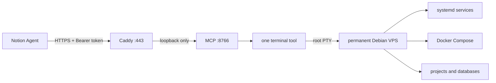
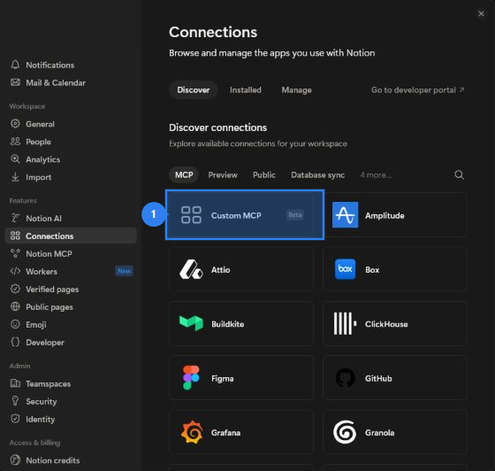
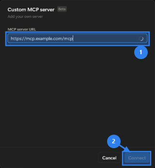
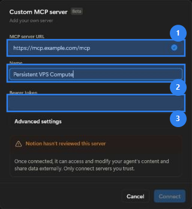
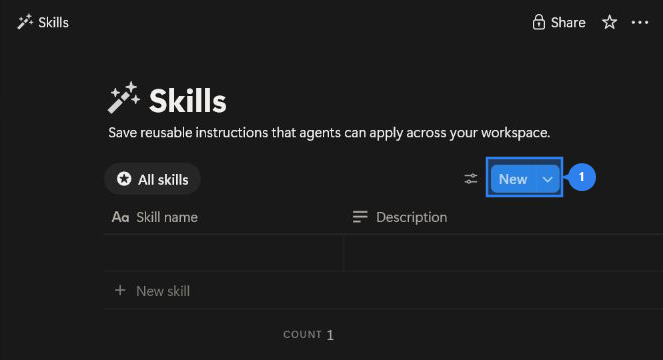

# Persistent VPS Compute MCP

[](https://github.com/m8rneco-a11y/persistent-vps-compute-mcp/actions/workflows/ci.yml)


Один постоянный Debian VPS как полноценное compute environment для Notion AI и других MCP-клиентов. Модель получает не набор из десятков искусственных DevOps-инструментов, а один нормальный root-терминал — почти как работа по SSH.

> [!CAUTION]
> Этот проект намеренно даёт удалённому AI-агенту настоящий доступ `root`. Bearer-токен равен root-паролю от сервера. Используйте отдельный VPS, HTTPS, резервные копии и только доверенные личные агенты.

## Чем это отличается от обычного «MCP для команд»

| Обычный подход | Persistent VPS Compute |
|---|---|
| Десятки отдельных tools для Git, файлов, pip, Docker | Один tool `terminal` |
| Искусственный список разрешённых операций | Любые обычные Linux-команды |
| Новая песочница или сброс между чатами | Одна и та же постоянная машина |
| Завершение чата останавливает работу | systemd-сервисы и Docker продолжают работать |
| Модель выдаёт команды пользователю | Модель сама устанавливает, пишет, тестирует и деплоит |

MCP поддерживает обычные и интерактивные терминальные процессы:

- `run` — запустить `bash -lc <command>`;
- `open` — открыть интерактивный root-shell;
- `read` / `write` — читать вывод и отправлять ввод;
- `interrupt` — Ctrl+C;
- `close` — закрыть только терминальный процесс;
- `list` — найти сохранённые терминальные процессы.

Файлы, установленные пакеты, репозитории, базы данных, Docker volumes и deployed-сервисы сохраняются между MCP-вызовами и чатами.

## Архитектура



Внутренний Python-порт слушает только `127.0.0.1`. В интернет выходят только Caddy и стандартные порты 80/443.

## Требования

- чистый или контролируемый VPS с Debian 12+ либо Ubuntu 22.04+;
- вход под `root` или пользователь с `sudo`;
- минимум 1 vCPU и 1 GB RAM;
- домен или поддомен, например `mcp.example.com`;
- DNS `A`/`AAAA` уже указывает на VPS;
- TCP 80 и 443 разрешены у провайдера и в firewall;
- для Custom MCP в Notion — тариф Business или Enterprise и разрешение администратора workspace ([официальная справка Notion](https://www.notion.com/help/mcp-connections-for-custom-agents)).

Автоустановщик сам поставит Python, virtualenv, Caddy и остальные системные зависимости. Docker не устанавливается заранее: агент сможет поставить его сам, когда он потребуется конкретному проекту.

## Быстрая установка

### Вариант 1: репозиторий уже доступен по SSH

Репозиторий приватный, поэтому GitHub-аккаунту или deploy key на VPS сначала нужен доступ.

```bash
git clone git@github.com:m8rneco-a11y/persistent-vps-compute-mcp.git
cd persistent-vps-compute-mcp
sudo bash install.sh
```

### Вариант 2: без настройки Git на VPS

1. На GitHub нажмите `Code` → `Download ZIP`.
2. Распакуйте архив и загрузите папку на VPS через панель хостинга, SFTP или SCP.
3. На VPS перейдите в загруженную папку и выполните:

```bash
sudo bash install.sh
```

Установщик спросит только публичный домен и подтверждение. После этого он:

1. проверит ОС и входные параметры;
2. установит системные пакеты;
3. сохранит резервную копию существующей установки;
4. установит приложение в `/opt/mcp-compute`;
5. создаст защищённый токен в `/etc/mcp-compute.env` с правами `0600`;
6. создаст и включит `mcp-compute.service`;
7. запустит полный MCP-тест через loopback;
8. добавит отдельный Caddy snippet и проверит конфигурацию до reload;
9. проверит публичный HTTPS health endpoint.

Он не меняет SSH, root-пароль, Docker, проекты и firewall. Если 80/443 закрыты у провайдера, установщик сообщит об этом, но не будет сам переписывать правила доступа.

### Неинтерактивный запуск

```bash
sudo bash install.sh --domain mcp.example.com --yes
```

Доступные параметры:

```text
--domain NAME     публичный DNS name
--port NUMBER     внутренний loopback-порт, по умолчанию 8766
--yes             не спрашивать подтверждение
--no-caddy        установить только приватный MCP-сервис
--rotate-token    выпустить новый токен при обновлении
```

Повторный запуск `install.sh` работает как обновление: сохраняет текущий токен, создаёт backup и переустанавливает код с зависимостями. Для принудительной смены токена добавьте `--rotate-token`.

## Проверка после установки

```bash
sudo /opt/mcp-compute/scripts/diagnose.sh
```

Ожидаемое состояние:

```text
MCP service:             active
MCP autostart:           enabled
Private listener:        127.0.0.1:8766
Local health:            ok
Caddy:                   active
Public health:           ok
```

Публичные адреса:

```text
https://mcp.example.com/healthz
https://mcp.example.com/mcp
```

`/healthz` публичный и возвращает только `ok`. `/mcp` без правильного Bearer-токена возвращает `401`.

## Получение Bearer-токена

Выполните только на VPS:

```bash
sudo /opt/mcp-compute/scripts/show-token.sh
```

Команда выводит чистое значение — без `MCP_TOKEN=` и без `Bearer `. Не вставляйте токен в README, Skill, issue, скриншот или обычное сообщение.

## Подключение к Notion AI

Полная пошаговая инструкция находится в [docs/NOTION_SETUP.md](docs/NOTION_SETUP.md).

### 1. Откройте Custom MCP

`Settings` → `Connections` → `Discover` → `MCP` → `Custom MCP`.



### 2. Введите адрес

В поле URL укажите свой адрес с обязательным `/mcp` и нажмите `Connect`.



### 3. Добавьте имя и токен

Укажите имя `Persistent VPS Compute`, выберите `Bearer token` и вставьте значение, полученное командой `show-token.sh`.



После подключения Notion увидит ровно один инструмент `terminal`.

- `Always ask` подходит для первого теста.
- `Run automatically` уменьшает количество подтверждений.
- `Always allow` даёт поведение, максимально близкое к Devin, но одновременно разрешает агенту выполнять любые root-команды без ручного подтверждения.

## Установка Skill

Готовый текст находится в [notion-skill/SKILL.md](notion-skill/SKILL.md). В нём нет домена, аккаунтных ID, токена или других секретов, поэтому один и тот же Skill можно переносить между workspace и аккаунтами.

Откройте `Library` → `Skills`, нажмите `New` и вставьте содержимое файла в новую страницу.



Рекомендуемые свойства:

```text
Name: Persistent VPS Compute
Description: Use the connected permanent VPS to develop, test, deploy, debug, and operate software end to end through one root terminal.
Use automatically: On
```

Для Custom Agent добавьте созданную страницу Skill в `Tools & Access`.

## Примеры задач для агента

```text
Разработай Telegram-бота по этому ТЗ. Сам установи нужные инструменты,
напиши код, прогони тесты и оставь production-сервис работающим после завершения.
```

```text
Проверь, почему API отвечает 502. Найди причину на VPS, исправь её,
перезапусти только нужный сервис и проверь публичный endpoint.
```

```text
Разверни этот репозиторий через Docker Compose, настрой автозапуск,
healthcheck и обратный прокси. Не трогай остальные проекты на сервере.
```

Skill объясняет агенту, что закрытие `session_id` завершает только конкретный shell, а не удаляет машину. Долгоживущие приложения должны работать через systemd или Docker Compose.

## Обслуживание

### Статус и диагностика

```bash
sudo /opt/mcp-compute/scripts/diagnose.sh
sudo systemctl status mcp-compute
sudo journalctl -u mcp-compute -f
```

### Смена токена

```bash
sudo /opt/mcp-compute/scripts/rotate-token.sh
```

После ротации обновите токен во всех MCP-клиентах. Старый перестаёт работать сразу после рестарта сервиса.

### Обновление

```bash
git pull
sudo bash install.sh
```

Установщик сохранит код и конфигурацию предыдущей версии в:

```text
/root/mcp-compute-backups/<UTC timestamp>/
```

### Удаление

```bash
sudo bash uninstall.sh
```

По умолчанию токен, MCP state и audit log сохраняются. Полное удаление только MCP-данных:

```bash
sudo bash uninstall.sh --purge
```

Uninstaller никогда не удаляет проекты, базы, Docker containers/volumes или сторонние systemd-сервисы.

## Перенос между Notion-аккаунтами

- Skill переносится как обычная Notion-страница или через этот `SKILL.md`.
- Сам VPS и MCP URL не зависят от Notion-аккаунта.
- Каждый новый Notion Agent или Custom Agent создаёт собственное подключение и заново вводит Bearer-токен.
- Если старый аккаунт больше не должен иметь доступ, отключите его и ротируйте токен.

Текущая версия сервера использует один общий токен. Если нескольким людям нужен одновременный независимый доступ с точечным отзывом, добавьте multi-token authentication перед выдачей доступа.

## Что проверяет CI

GitHub Actions при каждом push и pull request:

- проверяет синтаксис всех Bash-скриптов;
- запускает ShellCheck;
- компилирует Python;
- поднимает MCP от `root` на временном loopback-порту;
- выполняет полный end-to-end тест.

E2E-набор проверяет health, отказ без авторизации, блокировку чужого Origin, единственный tool, настоящий `uid=0`, очистку дочернего environment, сохранение файлов между вызовами, async polling и интерактивный PTY.

## Структура репозитория

```text
.
├── server.py                         # MCP-сервер
├── install.sh                        # интерактивная установка/обновление
├── uninstall.sh                      # безопасное удаление MCP
├── requirements.txt                  # зафиксированные Python-зависимости
├── caddy/mcp-compute.caddy           # HTTPS reverse-proxy template
├── systemd/mcp-compute.service       # автозапуск сервера
├── scripts/
│   ├── diagnose.sh                   # безопасная диагностика
│   ├── rotate-token.sh               # ротация Bearer-токена
│   └── show-token.sh                 # вывести чистое значение токена
├── tests/test_client.py              # полный MCP smoke/E2E test
├── notion-skill/SKILL.md             # переносимый Skill для Notion
├── docs/NOTION_SETUP.md              # подробное подключение к Notion
└── docs/images/                       # отредактированные UI-скриншоты
```

## Безопасность

Перед использованием обязательно прочитайте [SECURITY.md](SECURITY.md).

Коротко:

- не публикуйте Bearer-токен;
- не открывайте внутренний порт MCP в интернет;
- не расшаривайте агента с `Always allow` посторонним;
- храните provider snapshots и резервные копии важных данных;
- считайте prompt injection из сайтов, issues и загруженных файлов реальной угрозой;
- лучше использовать отдельный VPS, а не сервер с критичными личными данными.

## Совместимость

Протестировано на Debian 12, Python 3.11, FastMCP 3.4.7, Starlette 1.6.0 и Uvicorn 0.52.4. Транспорт — MCP Streamable HTTP, авторизация — стандартный HTTP Bearer token.
